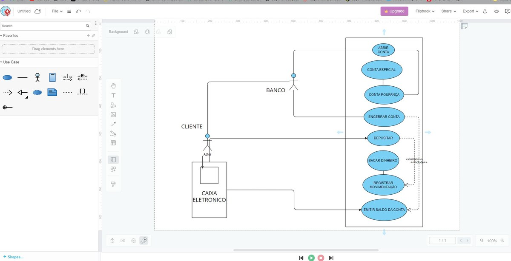

# 🏦 Sistema Bancário — Análise de Requisitos & UML

Modelagem completa de um **sistema bancário** utilizando Diagrama de Casos de Uso UML, desenvolvida com base em análise de requisitos funcionais. O projeto define atores, fronteiras do sistema e regras de negócio para operações bancárias.

Projeto desenvolvido como atividade prática da disciplina de **Análise e Modelagem de Sistemas** no curso de Tecnólogo em Análise e Desenvolvimento de Sistemas.

---

## 📸 Diagrama de Casos de Uso

---

## 👥 Atores do Sistema

| Ator           | Papel                                              |
|----------------|----------------------------------------------------|
| `Cliente`      | Realiza operações bancárias                        |
| `Funcionário`  | Intermedia abertura e encerramento de contas       |
| `Caixa Eletrônico` | Interface para operações autônomas do cliente  |

---

## 📋 Casos de Uso

| Caso de Uso             | Ator Principal     | Descrição                                        |
|-------------------------|--------------------|--------------------------------------------------|
| Abrir Conta             | Cliente + Funcionário | Abertura presencial com escolha do tipo de conta |
| Encerrar Conta          | Cliente + Funcionário | Apenas se saldo = zero                           |
| Depositar               | Cliente (Caixa)    | Inserção de valor via caixa eletrônico           |
| Sacar                   | Cliente (Caixa)    | Retirada conforme saldo disponível               |
| Consultar Saldo         | Cliente (Caixa)    | Exibição ou impressão do saldo atual             |
| Emitir Extrato          | Cliente (Caixa)    | Histórico completo de movimentações              |
| Registrar Movimentação  | Sistema            | Log automático de todas as operações             |

---

## ✨ Regras de Negócio Modeladas

- Conta só pode ser encerrada com **saldo zerado**
- Tipos de conta: **especial** ou **poupança**
- Todas as movimentações são **registradas automaticamente** para auditoria
- Operações de saque exigem **saldo suficiente**
- Abertura e encerramento exigem **atendimento presencial** com funcionário

---

## 🛠️ Tecnologias

---

## 👩‍💻 Autora

**Gabrielle Simone Cunha**

